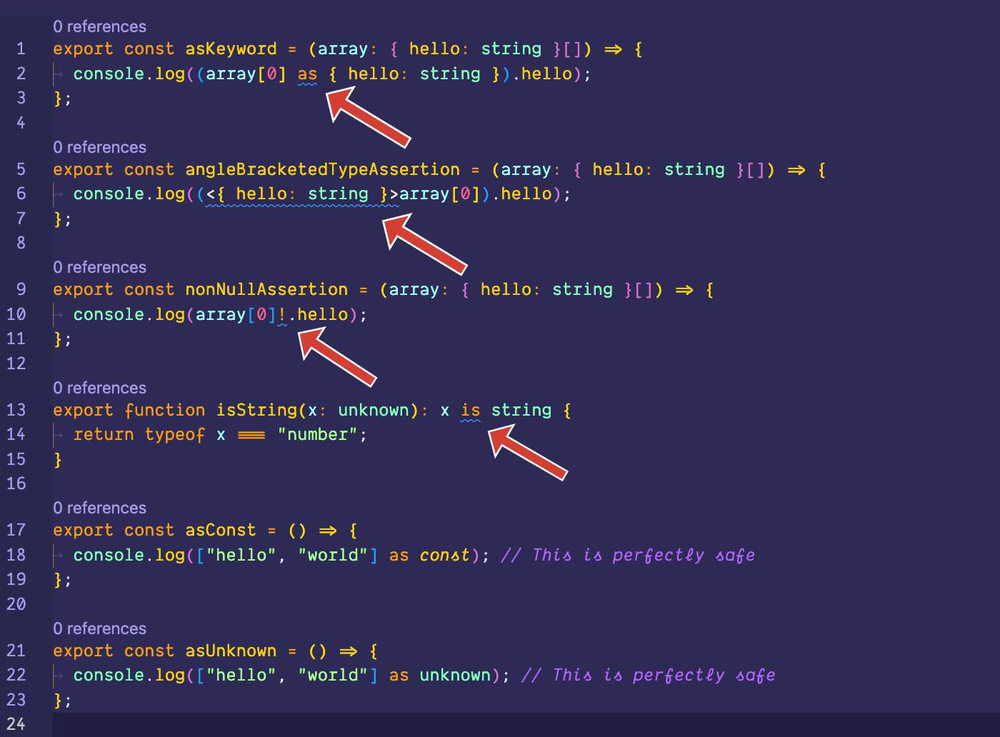

# Unsafe Typescript Highlighter for VS Code

Visually mark out unsafe Typescript features in your code.

**Supports**: Typescript, JSX (`.tsx`), and Vue or Svelte single component files.

## Features

It highlights: non-null assertions, type assertions (both, angle bracketed and those using the `as` keyword), and type predicates.

### Motivation

The purpose of this extension differs from traditional linting tools such as Eslint or Biome. While linting allows you to prohibit or warn against certain code practices, these messages can sometimes go unnoticed. The primary goal of the Unsafe TypeScript Highlighter is to ensure that you can consistently and effortlessly identify these problems through visual cues, so that they never escape your attention.

I got the idea from [this tweet by Matt Pocock](https://twitter.com/mattpocockuk/status/1732485506556940782), thank you for that and for spreading the word about Typescript.

## Extension Settings

This extension contributes the following settings:

- `unsafeTypescript.enable`: Controls whether the Unsafe Typescript Highlighter extension is enabled or disabled. It is enabled by default.
- `unsafeTypescript.run`: Specifies when the linter should run. Options are `onChange` (run the linter on every document change) or `onSave` (run the linter on document save). The default is `onChange`.
- `unsafeTypescript.decorate`: Determines the type of decoration for unsafe code. Options include `keyword` (decorate only the unsafe keyword inside the expression) or `expression` (decorate the whole unsafe expression). The default is `keyword`.
- `unsafeTypescript.highlight.nonNullAssertion.enable`: Enables or disables the highlighting of non-null assertions (`!`). It is enabled by default.
- `unsafeTypescript.highlight.asTypeAssertion.enable`: Enables or disables the highlighting of `as` type assertions. It is enabled by default.
- `unsafeTypescript.highlight.angleBracketedTypeAssertion.enable`: Enables or disables the highlighting of angle bracketed assertions. It is enabled by default.
- `unsafeTypescript.highlight.typePredicate.enable`: Enables or disables the highlighting of type predicates. It is enabled by default.

## Release Notes

### 1.0.0

Initial release of Unsafe Typescript Highlighter.

## License

This extension is licensed under the [MIT License](LICENSE).
